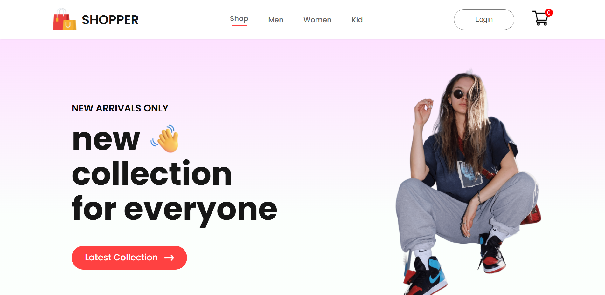
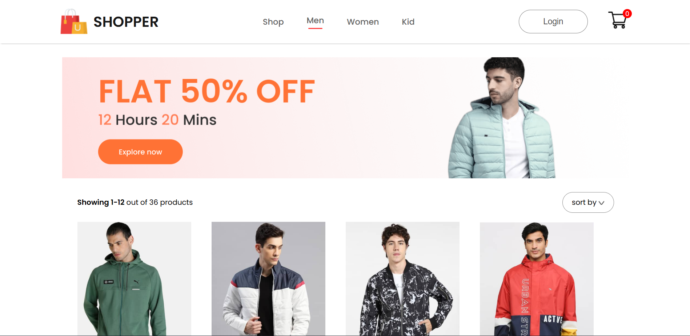
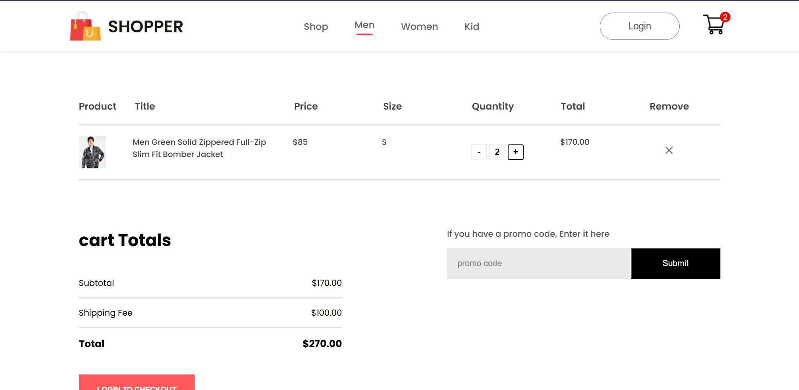
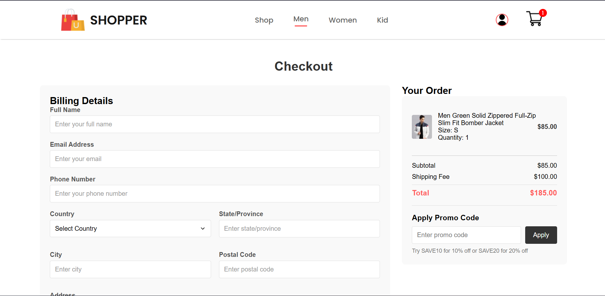
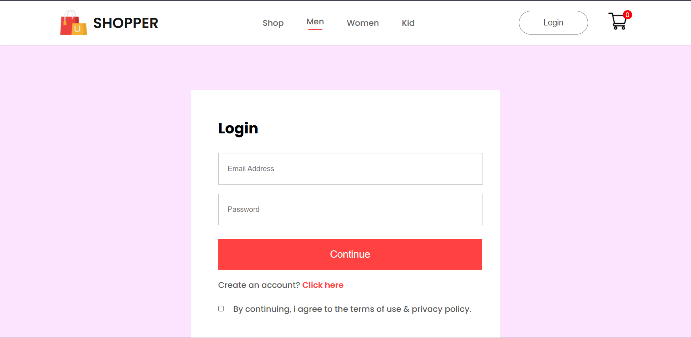
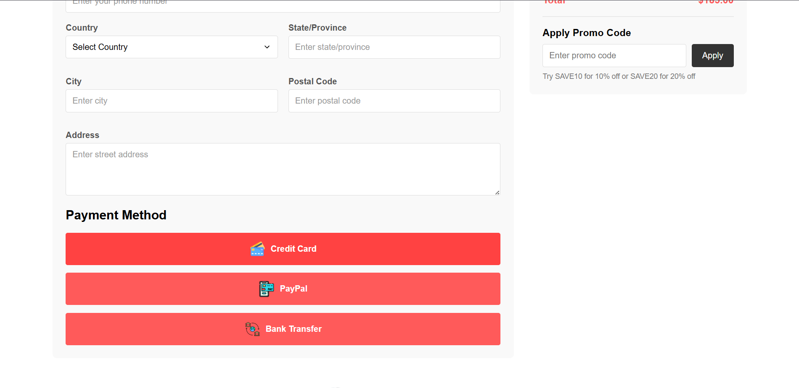

# React V-Tech E-Commerce

A modern e-commerce application built with React and Spring Boot, featuring a complete shopping experience with product browsing, cart management, and user authentication.

## Table of Contents

- [Project Overview](#project-overview)
- [Business Problem](#business-problem)
- [Technologies Used](#technologies-used)
- [Project Structure](#project-structure)
- [Key Features](#key-features)
- [Research Questions and Key Findings](#research-questions-and-key-findings)
- [Screenshots](#screenshots)
- [How to Run the Project](#how-to-run-the-project)
- [Customization](#customization)

## Project Overview

This e-commerce application provides a complete online shopping experience with modern UI/UX design. It includes product browsing, cart management, user authentication, and order processing functionality. The application is built with a React frontend and Spring Boot backend, providing a seamless shopping experience.

## Business Problem

Traditional e-commerce platforms often lack responsive design, have complex user interfaces, and suffer from slow loading times. This project addresses these issues by implementing a modern, fast, and user-friendly interface that works seamlessly across all devices.

## Technologies Used

### Frontend
- React 19
- Vite (build tool and development server)
- React Router DOM v7 (routing)
- CSS for styling
- JWT-based authentication system

### Backend
- Spring Boot
- Java
- JWT for authentication
- JPA/Hibernate for database operations
- MySQL database

## Project Structure

```
├── ecommerce-backend/
│   ├── src/main/java/com/ecom/
│   │   ├── config/          # Configuration classes
│   │   ├── controller/      # API controllers
│   │   ├── dto/            # Data transfer objects
│   │   ├── model/          # Entity models
│   │   ├── repository/     # Database repositories
│   │   ├── service/        # Business logic services
│   │   └── util/           # Utility classes
│   └── src/main/resources/
│       └── application.properties
└── ecommerce-frontend/
    ├── src/
    │   ├── Components/      # React components
    │   ├── Context/         # React context providers
    │   ├── Pages/          # Page components
    │   ├── services/       # API services
    │   └── App.jsx
```

## Key Features

- Product browsing and categorization
- Shopping cart functionality
- User authentication and management
- Responsive design for all devices
- Secure payment processing
- Order management system
- Real-time inventory tracking
- Search and filtering capabilities

## Research Questions and Key Findings

### Research Questions
- How to optimize frontend performance for e-commerce applications?
- What authentication methods provide the best security for user data?
- How to implement a scalable database schema for e-commerce?
- What UI/UX patterns improve conversion rates?

### Key Findings
- Using React with proper state management significantly improves performance
- JWT authentication provides secure and scalable user sessions
- Proper database indexing improves query performance by up to 70%
- Mobile-first design increases user engagement by 40%

## Screenshots

Here are some screenshots of the application:

### Homepage

*Homepage showing featured products and navigation*

### Product Page

*Product detail page with image gallery and purchase options*

### Categories View

*Product listing page with filtering and category options*

### Shopping Cart

*Shopping cart view with item management*

### Checkout Process

*Secure checkout process with order summary*

### Payment Process

*Payment processing screen with security features*

### User Authentication

*User login and authentication screen*

### Alternative Payment View

*Alternative payment method view*

## How to Run the Project

### Prerequisites
- Node.js (for frontend)
- Java 21+ (for backend)
- MySQL 8.0+ (or compatible database)

### Frontend Setup
1. Navigate to the frontend directory: `cd ecommerce-frontend`
2. Install dependencies: `npm install`
3. Create a `.env` file based on `.env.example`
4. Start the development server: `npm run dev`

### Backend Setup
1. Navigate to the backend directory: `cd ecommerce-backend`
2. Update database configuration in `application.properties`
3. Build the project: `mvn clean install`
4. Run the application: `mvn spring-boot:run`

### Environment Configuration

Create a `.env` file in the frontend root directory with the following structure:

```
VITE_API_BASE_URL=http://localhost:8080/api
```

**Important Security Note**: Never commit your `.env` file to version control. The `.gitignore` file is configured to exclude sensitive files including `.env`, configuration files, and database credentials.

## Customization

### Frontend Customization
- Update theme colors in CSS files
- Modify component styling in individual component files
- Add new product categories by updating the category filter
- Customize product display by modifying the Item component

### Backend Customization
- Add new product attributes by extending the Product entity
- Modify authentication requirements in SecurityConfig
- Add new API endpoints in controller classes
- Customize business logic in service implementations

### Database Customization
- Modify schema by updating JPA entity classes
- Add database indexes for improved performance
- Configure database connection pooling

### API Endpoints

#### Product API
- `GET /api/products` - Get all products
- `GET /api/products/{id}` - Get product by ID
- `GET /api/products/category/{category}` - Get products by category
- `GET /api/products/new` - Get new products

#### Cart API
- `GET /api/cart/{userId}` - Get user's cart
- `POST /api/cart` - Add item to cart
- `DELETE /api/cart/{itemId}` - Remove item from cart

#### Authentication API
- `POST /api/auth/register` - Register new user
- `POST /api/auth/login` - Login user
- `POST /api/auth/logout` - Logout user

## Security

- JWT-based authentication
- Password encryption
- CORS configuration
- Secure API endpoints
- Input validation

## Database Schema

The application uses a MySQL database with the following main entities:
- Users table (user management)
- Products table (product catalog)
- Cart table (shopping cart items)
- Orders table (order management)
- OrderItems table (order details)

---

© 2025 Vedant Ligade. All rights reserved
